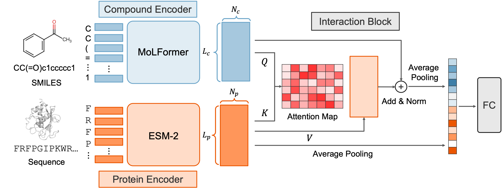

# ChemGLaM: Chemical Genomics Language Models for Compound-Protein Interaction Prediction

**Authors**: Takuto Koyama, Hayato Tsumura, Shigeyuki Matsumoto, Ryunosuke Okita, Ryosuke Kojima, and Yasushi Okuno

---
## Table of Contents <!-- omit in toc -->
- [ChemGLaM: Chemical Genomics Language Models for Compound-Protein Interaction Prediction](#chemglam-chemical-genomics-language-models-for-compound-protein-interaction-prediction)
  - [Description](#description)
  - [Requirements](#requirements)
  - [Directory Structure](#directory-structure)
  - [Usage](#usage)
    - [Finetuning for CPI datasets](#finetuning-for-cpi-datasets)
    - [Finetuning for BindingDB with Evidential Deep Learning (EDL)](#finetuning-for-bindingdb-with-evidential-deep-learning-edl)
    - [Inference with the finetuned model](#inference-with-the-finetuned-model)
    - [Run with Docker](#run-with-docker)
  - [Contact](#contact)
  - [Copyright](#copyright)
  - [Reference](#reference)
---


## Description
ChemGLaM is a large language model for Compound-Protein Interaction Prediction.



## Requirements

- python == 
- pytorch ==
- transformers == 
- pytorch-fast-transformers == 
- pytorch-lightning == 
- biopython == 
- rdkit 
- pandas
- scikit-learn
- debugpy

## Directory Structure

<!-- ```
.
├── data           : Directory for datasets 
├── dti_finetune   : Directory for finetuning
├── dti_result     : Output directory (created by running the script)
├── figures        : Figures for README.md
├── pretrain       : Directory for MoLFormer training (not used in this research)
├── LICENSE        : License file
└── README.md      : This file
``` -->

## Usage

### Finetuning for CPI datasets

The following is the example of the command for finetuning ChemGLaM with CPI datasets.

```python
python train.py -c /path/to/config.json
```

### Finetuning for BindingDB with Evidential Deep Learning (EDL)

Coming Soon.
<!-- If you want to use the [Evidential Deep Learning (EDL)](https://doi.org/10.48550/arXiv.1806.01768) for the finetuning, you can use the following script.

```bash
cd dti_finetune
bash run_bindingdb_edl.sh
``` -->

### Inference with the finetuned model

Coming Soon.
<!-- You can use the inference script by replacing the `--seed_path` with the path to the finetuned model.

```bash

cd dti_finetune
bash run_predict_classification.sh
``` -->

### Run with Docker

Coming Soon.

<!-- You can also run the script with Docker. First, build the Docker image with the following command.
```bash
cd ChemGLaM_dev
docker build --no-cache -t chemglam .
```
After building the Docker image, you can run the script with the following command. You can replace the `run_bindingdb.sh` with the script you want to run.
```bash
docker run -it --rm -v $(pwd):/workspace chemglam ./run_bindingdb.sh
``` -->

## Contact
- Takuto Koyama: koyama.takuto.82j[at]st.kyoto-u.ac.jp

## Copyright

This product includes source codes from the MoLFormer project by IBM Corporation (https://github.com/IBM/molformer), which is licensed under the Apache License 2.0. For details, see the `NOTICE.md` file.

## Reference
bioRxiv
```
@article{koyama2024chemglam,
  title={ChemGLaM: Chemical Genomics Language Models for Compound-Protein Interaction Prediction},
  author={Koyama, Takuto and Tsumura, Hayato and Matsumoto, Shigeyuki and Okita, Ryunosuke and Kojima, Ryosuke and Okuno, Yasushi},
  journal={bioRxiv},
  pages={2024--02},
  year={2024},
  publisher={Cold Spring Harbor Laboratory}
}
```