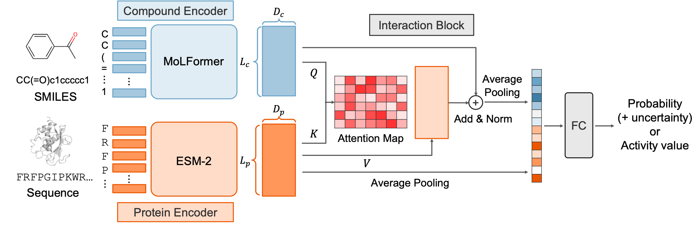

# ChemGLaM: Chemical Genomics Language Models for Compound-Protein Interaction Prediction


---
## Table of Contents <!-- omit in toc -->
- [ChemGLaM: Chemical Genomics Language Models for Compound-Protein Interaction Prediction](#chemglam-chemical-genomics-language-models-for-compound-protein-interaction-prediction)
  - [Description](#description)
  - [Directory Structure](#directory-structure)
  - [Environment Setup](#environment-setup)
  - [Usage](#usage)
    - [Finetuning for CPI datasets](#finetuning-for-cpi-datasets)
    - [Finetuning for classification with Evidential Deep Learning (EDL)](#finetuning-for-classification-with-evidential-deep-learning-edl)
    - [Inference with the finetuned model](#inference-with-the-finetuned-model)
    - [Run with Docker](#run-with-docker)
  - [Contact](#contact)
  - [Reference](#reference)
---


## Description
ChemGLaM is a large language model for Compound-Protein Interaction Prediction.



## Directory Structure

```
.
├── cache                : Directory for protein embeddings
├── chamglam             : Source code for ChemGLaM
├── config               : Config examples
├── data                 : Directory for datasets 
├── figures              : Figures for README.md
├── logs                 : Output Directory
├── script               : Script examples
├── Dockerfile           : Docker file
├── LICENSE              : License file
├── predict.py           : main script for prediction
├── prediction_demo.ipynb: example for inference one pair
├── README.md            : This file
├── setup.py             : setup file
└── train.py             : main script for fine-tuning
```

## Environment Setup

To set up the environment for this project, follow these steps:

1. Create a new conda environment named `chemglam` with Python 3.11:
    ```bash
    conda create -n chemglam -y python=3.11
    ```
2. Activate the environment:
    ```bash 
    conda activate chemglam
    ```
3. Install the required dependencies:
    ```bash
    pip install -e .
    ```
4. Install RDKit (version 2024.9.2) from the conda-forge channel:
    ```bash
    conda install -c conda-forge rdkit=2024.9.2
    ```

## Usage

### Finetuning for CPI datasets

The following is the example of the command for finetuning ChemGLaM with CPI datasets.

```python
python train.py -c /path/to/config.json
```

### Finetuning for classification with Evidential Deep Learning (EDL)

By setting the argument ```"evidential"``` as ``true`` in a config file, you can run EDL for classification tasks.
```python
python train.py -c /path/to/edl_config.json
```

### Inference with the finetuned model

Coming Soon.  
You can use the inference script by specifying the `--checkpoint_path` with the path to the finetuned model and setting `deterministic_eval: true` for reproducible results.

```bash
python predict.py -c /path/to/inference_config.json
```

### Run with Docker

You can also run the script with Docker. First, build the Docker image with the following command.

```bash
cd ChemGLaM_huggingface
docker build --no-cache -t chemglam .
```

After building the Docker image, you can run the script with the following command. You can replace the `python train.py -c config/benchmark/bindingdb_cv0.json` with the script you want to run. Here is an example of how to execute the training script for a specific configuration:
```bash
docker run --gpus all -it --rm -u `id -u`:`id -g` \
-v $(pwd):/workspace chemglam \
python train.py -c config/benchmark/bindingdb_cv0.json
```

## Contact
- Takuto Koyama: koyama.takuto.82j[at]st.kyoto-u.ac.jp

## Reference
bioRxiv
```
@article{koyama2024chemglam,
  title={ChemGLaM: Chemical Genomics Language Models for Compound-Protein Interaction Prediction},
  author={Koyama, Takuto and Tsumura, Hayato and Matsumoto, Shigeyuki and Okita, Ryunosuke and Kojima, Ryosuke and Okuno, Yasushi},
  journal={bioRxiv},
  pages={2024--02},
  year={2024},
  publisher={Cold Spring Harbor Laboratory}
}
```